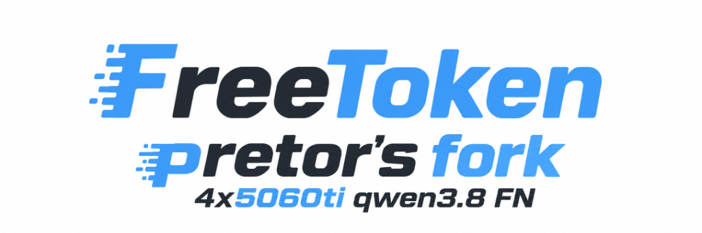

<div align="center">
  
</div>

<p align="center">
| <a href="https://www.flashml.ai/"><b>Download</b></a> | <a href="https://arxiv.org/abs/2608.16157"><b>Paper</b></a> | <a href="https://join.slack.com/t/flashml/shared_invite/zt-3zpdh5j10-9dwTXrgLiqpVxizhA9KVbA"><b>Developer Slack</b></a> | <a href="https://discord.gg/MsA277cJzZ"><b>Community Discord</b></a> | <a href="https://github.com/FlashML-org/FreeToken/issues/482"><b>Community WeChat</b></a> |
</p>


Unlock datacenter-class intelligence on the hardware you already own — Run 290B+ frontier MoE models locally on your gaming PC at blistering interactive speeds.

## This Fork: 4x RTX 5060 Ti & Consumer Multi-GPU Optimization

This fork by **[@pretor](https://github.com/pretor)** is specifically engineered and battle-tested for high-throughput serving of frontier MoE architectures on consumer multi-GPU workstations (specifically **4x NVIDIA GeForce RTX 5060 Ti 16GB** over PCIe 4.0, without NVLink or P2P).

### What This Fork Adds (Beyond Upstream `main`):

1. **MXFP8 Tensor-Parallel (TP) Weight Sharding (by @pretor)**:
   - **Custom Implementation**: Created and integrated full Tensor-Parallel (TP4) row/column weight sharding for **MXFP8** dense layers, merger projections, and shared experts.
   - **Why It Matters**: Upstream FreeToken only supported single-GPU (TP=1) or duplicated layouts for MXFP8 weights. This sharding allows modern hybrid checkpoints—which pair NVFP4 routed experts with MXFP8 shared experts—to partition weights cleanly across 4 GPUs, saving precious VRAM and unlocking true multi-GPU scaling.

2. **Vision Tower TP Sharding (Multi-Modal Acceleration)**:
   - Shards vision encoder weights across all TP ranks (`_shard_vision_tensor`), dividing ViT memory to only **~214 MB per GPU** instead of duplicating 856 MB on every card or crashing under TP > 1.

3. **CPU Vision Encoder: the Vision Tower in RAM, Zero VRAM (`--mm-encoder-weights cpu`)**:
   - **What**: image input on Qwen3.8-Flash-Next without spending VRAM. The vision tower (27-block ViT, ~449M params) lives once in host RAM in FP32 and runs in its own CPU process (`freetoken-vision-cpu`, no CUDA device visible), modelled on [strata-nvfp4](https://github.com/sergqwer/strata-nvfp4)'s `strata-vision` sidecar.
   - **How it works**: the tokenizer sends only the requests that carry images to the encoder process. It replaces each image's pixels with the tower's output rows and passes the request on to the scheduler. The 4 TP ranks build and load no tower, so the KV cache and the expert cache keep their full size, and running requests keep decoding while an image encodes. Text-only requests never pass through it.
   - **Why FP32 on the CPU**: these Xeons have no BF16 or AMX units. BF16 was ~2x slower than FP32 and ~11-12% off it at 1024 tokens, the same drift the BF16 GPU tower shows against FP32.
   - **Knobs**:
     - Images are capped at 1024 tokens unless `--image-max-tokens` is given.
     - `--mm-encoder-cache-mb` (default 256) keeps recently encoded images, so an image a chat client resends every turn is encoded once.
     - `--mm-encoder-threads` / `--mm-encoder-cpus` control placement. By default it uses one NUMA node's physical cores, not pinned; that measured fastest.
   - **Measured on this ThinkStation (2x Xeon Gold 6152, 22 threads)**:
     - Encode time per image: 1.1 s at 256 tokens, 2.0 s at 484, 5.4 s at 1024, 16.6 s at 2025.
     - Against `--text-model-only`: VRAM grows by ~20 MiB per GPU, the KV cache (200k tokens) and expert cache are unchanged, text decode is unchanged (~62-64 tok/s), and the encoder process takes ~2.4 GB RSS.
     - End to end: the model reads image content correctly (colours, text in the picture), a resent image comes from the cache, a corrupt image gets a clean 400, and an abort mid-encode is handled.
   - Details: [CPU vision encoder](docs/cli.md#cpu-vision-encoder); benchmark: `benchmarks/bench_cpu_vision.py`.

4. **Pre-Merged Cutting-Edge Upstream PRs**:
   - **[PR #635](https://github.com/FlashML-org/FreeToken/pull/635)**: `perf(moe): avoid intra-op fanout while filling NVFP4 host banks` — eliminates intra-op fanout latency when populating host-side NVFP4 expert banks.
   - **[PR #636](https://github.com/FlashML-org/FreeToken/pull/636)**: `feat(quant): opt-in fp8-block QAT for the lm_head` — enables FP8-block quantized LM heads to conserve GPU memory.
   - **[PR #639](https://github.com/FlashML-org/FreeToken/pull/639)**: `feat(server): add --api-key authentication` — adds `--api-key` and `$FREETOKEN_API_KEY` bearer authentication to protect the server endpoint.

5. **Production Stability & 200k Context Resilience**:
   - Custom timeout flags (`--step-timeout 120`, `--distributed-timeout 2592000`) that prevent NCCL heartbeat and rendezvous timeouts during long idle stretches or heavy prefill batches.
   - Production-verified **FP8 KV-Cache** across up to **200,000 tokens** (~1.31 GiB VRAM per GPU for 200k tokens).

---

### Tested & Verified Models:

These models have been tested and run at full speed on this fork:

1. **[local-inference-lab/Qwen3.8-Flash-Next-NVFP4](https://huggingface.co/local-inference-lab/Qwen3.8-Flash-Next-NVFP4)**
   - *Architecture*: 177B total parameter MoE, Quantization-Aware Distilled (QAD).
   - *Quantization*: NVFP4 routed experts + MXFP8 shared experts, BF16 attention & embeddings.
   - *Performance*: Achieves **~62–65 tokens/sec decode** on 4x RTX 5060 Ti with interactive latency.
   - *Vision*: image input served by the CPU vision encoder (`--mm-encoder-weights cpu`), with no VRAM spent on the vision tower.

2. **[RadixArk/Qwen3.8-Flash-Next-NVFP4](https://huggingface.co/RadixArk/Qwen3.8-Flash-Next-NVFP4)** (Base: [Qwen/Qwen3.8-Flash-Next](https://huggingface.co/Qwen/Qwen3.8-Flash-Next))
   - *Architecture*: ModelOpt-quantized candidate release of Qwen3.8 Flash Next.
   - *Quantization*: W4A4 NVFP4 routed experts with standard dense layers.

---

### Production Launch Setup (4x RTX 5060 Ti TP=4)

Below is our production launch configuration used on Lenovo ThinkStation P920 (4x RTX 5060 Ti 16GB):

```bash
# 1. Convert checkpoint to FTW format (pre-seeds expert banks for instant load)
ft checkpoint convert \
  --model local-inference-lab/Qwen3.8-Flash-Next-NVFP4 \
  --output /models/local-inference-lab-Qwen3.8-Flash-Next-NVFP4-FTW

# 2. Launch FreeToken server (TP=4, 200k context, FP8 KV cache, 15,000 MoE cache slots, image input on the CPU)
numactl --interleave=all ft serve \
  --model /models/local-inference-lab-Qwen3.8-Flash-Next-NVFP4-FTW \
  --tp-size 4 \
  --gpu 0,1,2,3 \
  --moe-strategy offload \
  --quant-backend moe.nvfp4=triton \
  --ple-backend pinned \
  --expert-load serial \
  --embed-device cpu \
  --decode-interleave-every 4 \
  --moe-cache-size 15000 \
  --memory-ratio 0.95 \
  --moe-prefill-hit-d2d \
  --kv-cache-dtype fp8 \
  --num-tokens 200000 \
  --max-seq-len-override 200000 \
  --kv-reserve-tokens 200000 \
  --max-running-requests 2 \
  --cuda-graph-max-bs 2 \
  --max-extend-length 4096 \
  --mamba-host-slots 32 \
  --served-model-name Qwen3.8-Flash-Next-NVFP4-QAD \
  --mm-encoder-weights cpu \
  --step-timeout 120 \
  --distributed-timeout 2592000 \
  --host 0.0.0.0 --port 8000

# 3. Send an image (OpenAI API; an http(s) URL or a base64 data: URL)
curl http://localhost:8000/v1/chat/completions -H 'Content-Type: application/json' -d '{
  "model": "Qwen3.8-Flash-Next-NVFP4-QAD",
  "messages": [{"role": "user", "content": [
    {"type": "image_url", "image_url": {"url": "https://example.com/picture.png"}},
    {"type": "text", "text": "What is in this picture?"}]}]}'
```

`--mm-encoder-weights cpu` serves images with the vision tower on the CPU (see item 3 above); images are
capped at 1024 tokens unless `--image-max-tokens` is given. For text-only serving, use `--text-model-only`
instead, which also saves the encoder process's ~2.4 GB of RAM.

---

## About

FreeToken is an edge-native Mixture-of-Experts (MoE) serving engine designed for running frontier-scale open-weight models on personal and consumer hardware. It treats heterogeneous edge resources—GPUs, CPUs, host memory, and interconnects—as a unified, elastic inference platform. Its core features include:  

- **Fast Edge-Native Runtime**: Provides efficient MoE serving with bandwidth-adaptive CPU–GPU co-execution ($q^\star$ policy), full-layer double-buffered prefill streaming, global LRU expert caching, graph-compatible execution, and the FTW fast weight format.  
- **Semantic-Aware Caching**: Features semantic anchor checkpoints for recurrent state and KV caches, allowing agentic context edits (e.g., tool calls, thinking blocks) to avoid redundant context recomputation.  
- **Elastic Memory Management**: Supports dynamic, runtime VRAM re-allocation between expert caches and KV memory without engine restarts or weight reloading.  
- **Broad MoE & Ecosystem Support**: Supports frontier open-weight MoE models (e.g., DeepSeek-V4-Flash, Qwen3.6-35B-A3B, GLM-5.2) across various parameter scales and quantization formats (e.g., MXFP4, NVFP4, FP8, BF16), with Anthropic/OpenAI-compatible APIs for seamless integration with real-world coding and tool-calling agents (e.g., Codex, Claude Code, OpenCode, OpenClaw, DeepSeek Harness). 
- **Diverse Consumer Hardware**: Scales across consumer laptops, gaming desktops, and workstation GPUs, with native support for NVIDIA RTX 30, RTX 40, and RTX 50 series GPUs.  

## Getting Started

### Desktop app

Download FreeToken for Windows or Linux at [flashml.ai](https://www.flashml.ai/). It sets the engine up for you and gives you a GUI for running models, chatting, and tuning the engine.

<div align="center">
  
</div>

### CLI

Install FreeToken with [uv](https://docs.astral.sh/uv/) (recommended) or pip:

```bash
uv pip install "freetoken[accel]"
```

Or build from source:

```bash
git clone https://github.com/FlashML-org/FreeToken.git && cd FreeToken
uv venv && source .venv/bin/activate
uv pip install -e ".[accel]"
```

For More details:

- [Install FreeToken](https://github.com/FlashML-org/FreeToken/blob/main/docs/install.md)
- [Quick start](https://github.com/FlashML-org/FreeToken/blob/main/docs/quickstart.md)
- [Supported models](https://github.com/FlashML-org/FreeToken/blob/main/docs/models.md)
- [CLI reference](https://github.com/FlashML-org/FreeToken/blob/main/docs/cli.md)
- [Repairing old FTW checkpoints](https://github.com/FlashML-org/FreeToken/blob/main/docs/ftw-hotfix.md)

## Citation

If you use FreeToken for your research, please cite our [paper](https://arxiv.org/abs/2608.16157):

```bibtex
@article{yang2026freetoken,
  title={FreeToken: Efficient Edge-Native MoE Serving with Bandwidth-Adaptive Execution},
  author={Yang, Shuo and Fan, Xiaoze and Pan, Melissa and Xi, Haocheng and Wang, Zhe and Sun, Shanlin and Keutzer, Kurt and Han, Song and Zaharia, Matei and Xu, Chenfeng and Stoica, Ion},
  journal={arXiv preprint arXiv:2608.16157},
  year={2026}
}
```

## Acknowledgment

FreeToken was deeply inspired by [mini-sglang](https://github.com/sgl-project/mini-sglang), and
learned the design and reused code from the following projects:
[SGLang](https://github.com/sgl-project/sglang),
[vLLM](https://github.com/vllm-project/vllm),
[FlashInfer](https://github.com/flashinfer-ai/flashinfer),
[flash-linear-attention](https://github.com/fla-org/flash-linear-attention),
[LightLLM](https://github.com/ModelTC/lightllm) and [llama.cpp](https://github.com/ggml-org/llama.cpp).

## License

[Apache License 2.0](https://github.com/FlashML-org/FreeToken/blob/main/LICENSE).
